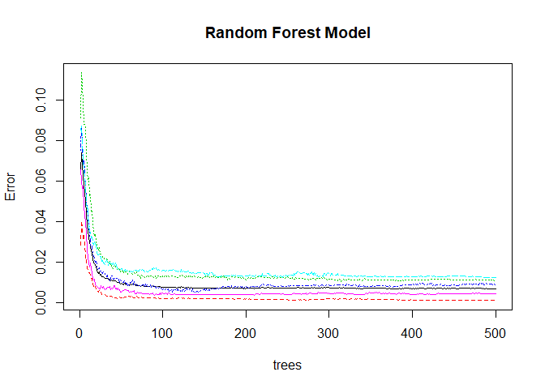

# Practical Machine Learning Project
Flavio Angeli  
18 July 2017  


## Instructions  
Using devices such as Jawbone Up, Nike FuelBand, and Fitbit it is now possible to collect a large amount of data about personal activity relatively inexpensively. These type of devices are part of the quantified self movement - a group of enthusiasts who take measurements about themselves regularly to improve their health, to find patterns in their behavior, or because they are tech geeks. One thing that people regularly do is quantify how much of a particular activity they do, but they rarely quantify how well they do it. In this project, your goal will be to use data from accelerometers on the belt, forearm, arm, and dumbell of 6 participants. They were asked to perform barbell lifts correctly and incorrectly in 5 different ways. More information is available from the website [here](http://groupware.les.inf.puc-rio.br/har) (see the section on the Weight Lifting Exercise Dataset).

The goal of the project is to predict the manner in which they did the exercise. This is the "classe" variable in the training set. 

## Data uploading

```r
# Packages
library(caret)

# Data uploading
url_train <- 'https://d396qusza40orc.cloudfront.net/predmachlearn/pml-training.csv'
url_test <- 'https://d396qusza40orc.cloudfront.net/predmachlearn/pml-testing.csv'
download.file(url_train,'train.csv')
train_data <- read.csv('train.csv')
download.file(url_test,'test.csv')
test_data <- read.csv('test.csv')
```

## Exploratory analysis  
The training data contains 19622 rows and 160 columns, of which 158 are predictors.

```r
dim(train_data)
```

```
## [1] 19622   160
```

```r
dim(test_data)
```

```
## [1]  20 160
```
The variable we want to predict is **classe**, the manner in which they did the exercise. In particular six young health participants were asked to perform one set of 10 repetitions of the Unilateral Dumbbell Biceps Curl in five different fashions: exactly according to the specification (Class A), throwing the elbows to the front (Class B), lifting the dumbbell only halfway (Class C), lowering the dumbbell only halfway (Class D) and throwing the hips to the front (Class E).

```r
levels(train_data$classe)
```

```
## [1] "A" "B" "C" "D" "E"
```
Observing the columns (variables), it is possible to notice that the first seven columns do not seem to be useful predictors. They are variables related to the partecipants and the time when the experiment was conducted. 

```r
# Remove first seven columns
exper <- names(train_data[1:7])
exper
```

```
## [1] "X"                    "user_name"            "raw_timestamp_part_1"
## [4] "raw_timestamp_part_2" "cvtd_timestamp"       "new_window"          
## [7] "num_window"
```

```r
train_data <- train_data[,8:160]
```

The data set contains many NA values, for this reason the columns with NA values are not considered for training the model. (Imputation could have been another option.)

```r
# Columns with NA values are not considered in the model
nas <- apply(train_data,2,anyNA)
columns_notNA <- names(nas[!nas])
train_data <- train_data[,columns_notNA]
dim(train_data)
```

```
## [1] 19622    86
```

Another step is to remove the variables with near zero variance, they are not useful as predictors for the model.

```r
# Check and remove near zero var columns
zerovar <- nearZeroVar(train_data,saveMetrics = T)
train_data <- train_data[,zerovar$nzv==FALSE]
dim(train_data)
```

```
## [1] 19622    53
```

Before moving on with the model fitting, the **train_data** set is split into two sets to train different models and select (test) the best performing one. In this way the initial testing set downloaded at the beginning is only going to be used for the final prediction with the best model. Using it to select the best model would not be efficient.


```r
# From train_data create training and testing 
inTrain <- createDataPartition(train_data$classe,p=0.7,list = FALSE)
train_model <- train_data[inTrain,]
test_model <- train_data[-inTrain,]
```


## Model
Because this is a classification problem the machine learning models tested are Random Forest and Gradient Boosting Machine (GBM).

A **Random Forest** model is trained, using cross validation to determine the parameters and setting it   5 folds (lower than default of 10 to save computing time). 


```r
# Train a random forest 
set.seed(123)
trControl <- trainControl(method = 'cv',number = 5)
fit_rf <- train(classe~., data = train_model,method='rf',trControl=trControl,prox=T)
fit_rf$finalModel
```

```
## 
## Call:
##  randomForest(x = x, y = y, mtry = param$mtry, proximity = ..1) 
##                Type of random forest: classification
##                      Number of trees: 500
## No. of variables tried at each split: 27
## 
##         OOB estimate of  error rate: 0.68%
## Confusion matrix:
##      A    B    C    D    E class.error
## A 3902    2    1    0    1 0.001024066
## B   20 2629    6    3    0 0.010910459
## C    0   14 2375    7    0 0.008764608
## D    0    1   24 2224    3 0.012433393
## E    0    0    3    8 2514 0.004356436
```
Now we verify the model on the *test_model* set to see how well it performs. 

```r
# Prediction on test data
pred_rf <- predict(fit_rf,test_model)
conf_rf <- confusionMatrix(pred_rf,test_model$classe)
conf_rf
```

```
## Confusion Matrix and Statistics
## 
##           Reference
## Prediction    A    B    C    D    E
##          A 1670    8    0    0    0
##          B    4 1127    3    0    1
##          C    0    4 1019   17    0
##          D    0    0    4  947    1
##          E    0    0    0    0 1080
## 
## Overall Statistics
##                                           
##                Accuracy : 0.9929          
##                  95% CI : (0.9904, 0.9949)
##     No Information Rate : 0.2845          
##     P-Value [Acc > NIR] : < 2.2e-16       
##                                           
##                   Kappa : 0.991           
##  Mcnemar's Test P-Value : NA              
## 
## Statistics by Class:
## 
##                      Class: A Class: B Class: C Class: D Class: E
## Sensitivity            0.9976   0.9895   0.9932   0.9824   0.9982
## Specificity            0.9981   0.9983   0.9957   0.9990   1.0000
## Pos Pred Value         0.9952   0.9930   0.9798   0.9947   1.0000
## Neg Pred Value         0.9990   0.9975   0.9986   0.9966   0.9996
## Prevalence             0.2845   0.1935   0.1743   0.1638   0.1839
## Detection Rate         0.2838   0.1915   0.1732   0.1609   0.1835
## Detection Prevalence   0.2851   0.1929   0.1767   0.1618   0.1835
## Balanced Accuracy      0.9979   0.9939   0.9944   0.9907   0.9991
```
In the following chart, we can see how the error drastically decreases with the increasing number of trees.

```r
# Plot error versus number of trees
plot(fit_rf$finalModel,main = 'Random Forest Model')
```

<!-- -->

It is also possible to see the importance of the predictors used in the model. 

```r
# See predictors importance in the rf model
varImp(fit_rf)
```

```
## rf variable importance
## 
##   only 20 most important variables shown (out of 52)
## 
##                      Overall
## roll_belt            100.000
## pitch_forearm         59.515
## yaw_belt              54.281
## pitch_belt            44.923
## magnet_dumbbell_y     44.731
## magnet_dumbbell_z     42.217
## roll_forearm          41.142
## accel_dumbbell_y      21.784
## roll_dumbbell         16.691
## magnet_dumbbell_x     16.457
## accel_forearm_x       16.038
## magnet_belt_z         14.788
## accel_dumbbell_z      14.661
## total_accel_dumbbell  13.332
## magnet_forearm_z      13.021
## magnet_belt_y         12.067
## accel_belt_z          12.033
## gyros_belt_z          11.186
## yaw_arm               10.803
## magnet_belt_x          9.678
```

The second model is **Gradient Boosting Machine (GBM)**.

```r
# Train gbm model
fit_gbm <- train(classe~.,data = train_model,method='gbm',trControl=trControl,verbose=F)
fit_gbm$finalModel
```

```
## A gradient boosted model with multinomial loss function.
## 150 iterations were performed.
## There were 52 predictors of which 43 had non-zero influence.
```
Now we verify the model on the *test_model* data set to see how well it performs. 

```r
# Prediction from gbm
pred_gbm <- predict(fit_gbm,test_model)
conf_gbm <- confusionMatrix(pred_gbm,test_model$classe)
conf_gbm
```

```
## Confusion Matrix and Statistics
## 
##           Reference
## Prediction    A    B    C    D    E
##          A 1642   38    0    2    0
##          B   22 1058   29    6   12
##          C    6   41  983   35   11
##          D    3    2   12  913    8
##          E    1    0    2    8 1051
## 
## Overall Statistics
##                                           
##                Accuracy : 0.9596          
##                  95% CI : (0.9542, 0.9644)
##     No Information Rate : 0.2845          
##     P-Value [Acc > NIR] : < 2.2e-16       
##                                           
##                   Kappa : 0.9488          
##  Mcnemar's Test P-Value : 2.166e-06       
## 
## Statistics by Class:
## 
##                      Class: A Class: B Class: C Class: D Class: E
## Sensitivity            0.9809   0.9289   0.9581   0.9471   0.9713
## Specificity            0.9905   0.9855   0.9809   0.9949   0.9977
## Pos Pred Value         0.9762   0.9388   0.9136   0.9733   0.9896
## Neg Pred Value         0.9924   0.9830   0.9911   0.9897   0.9936
## Prevalence             0.2845   0.1935   0.1743   0.1638   0.1839
## Detection Rate         0.2790   0.1798   0.1670   0.1551   0.1786
## Detection Prevalence   0.2858   0.1915   0.1828   0.1594   0.1805
## Balanced Accuracy      0.9857   0.9572   0.9695   0.9710   0.9845
```

We can now compare the **Accuracy** of the two models and notice that Random Forest is the best performing model.

```r
# Compare the two models 
acc_rf <- round(conf_rf$overall[1],4)
acc_gbm <- round(conf_gbm$overall[1],4)
df <- data.frame('Models'= c('Accuracy','Out of sample error estimate'),
            'Random Forest'=c(acc_rf,1-acc_rf),
            'GBM'=c(acc_gbm,1-acc_gbm))
print(df,row.names=F)
```

```
##                        Models Random.Forest    GBM
##                      Accuracy        0.9929 0.9596
##  Out of sample error estimate        0.0071 0.0404
```

## Prediction
According to the accuracy measured in the previous section, the best model is the **Random Forest**. This model can now be used to predict **classe** for the test data (20 different test cases).

```r
# Predict on the 20 different test cases.
pred_final <- predict(fit_rf,test_data)
pred_final
```

```
##  [1] B A B A A E D B A A B C B A E E A B B B
## Levels: A B C D E
```

